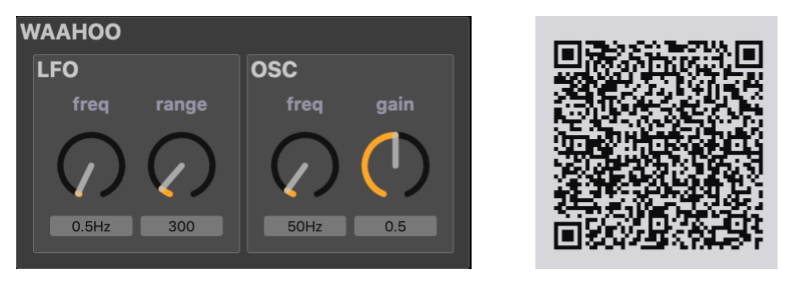

# Waaahooo
Un petit module sonore qui fait *waaahoooo*. Scanner le QR code avec votre téléphone pour jouer avec.

Sinon vous pouvez utiliser cette URL depuis un ordinateur :

[https://faustide.grame.fr/?autorun=1&code=https://raw.githubusercontent.com/orlarey/wahoo/master/examples/wahoo.dsp](https://faustide.grame.fr/?autorun=1&code=https://raw.githubusercontent.com/orlarey/wahoo/master/examples/wahoo.dsp)

